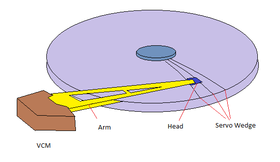
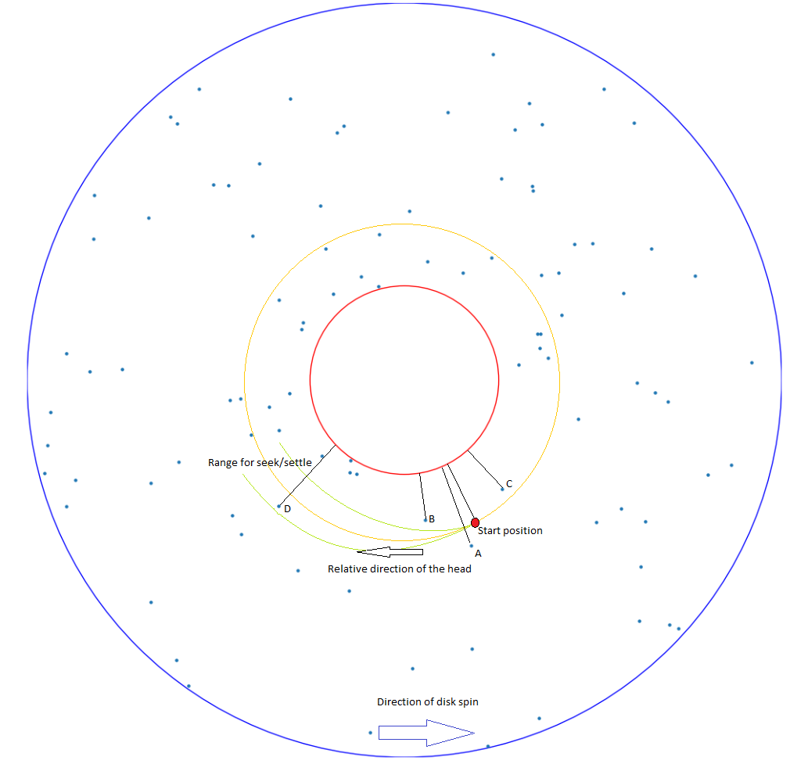
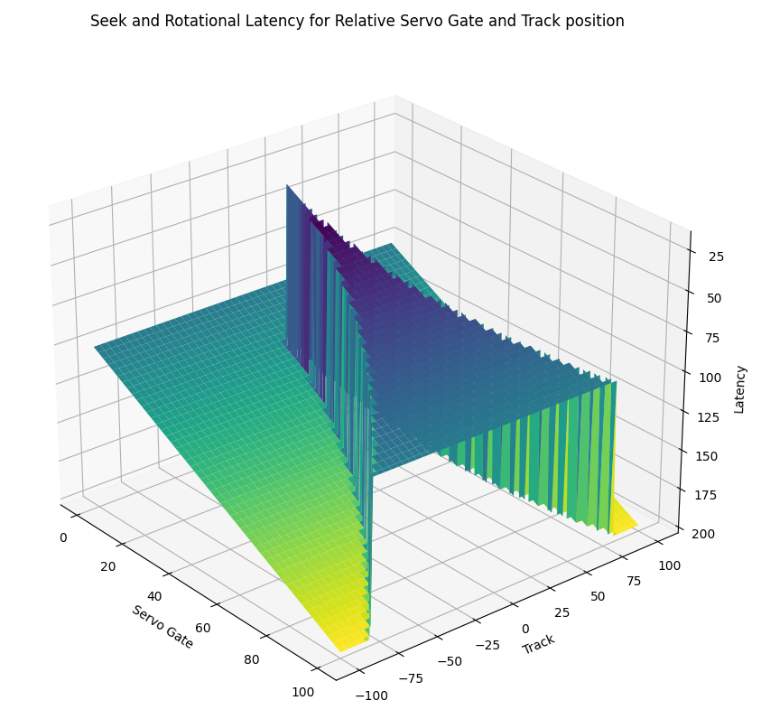

# Draft version - Please do not use
Rotational Latency Reordering scheme for block device

## Introduction
Random access block storage devices have electro-mechanical apparatus to move the data accessing sensor to the point where the desired data is located. When such devices are to handle multiple data access at a time, it is possible to gain performance boost by changing the order of data access.

This project is an example of such reordering schemes, targeted specifically for hard disk drives.

## Hard Disk Drive

Hard disk drives (HDDs) are a type of non-volatile storage device used for storing and retrieving digital data. They consist of several key components that work together to enable data storage and retrieval.

Platters: Hard disk drives have one or more rotating platters made of a rigid material, typically coated with a magnetic material. The platters are stacked on a spindle and spin at high speeds, usually ranging from 5,400 to 15,000 revolutions per minute (RPM).

Read/Write Heads: Each platter has a dedicated read/write head positioned very close to its surface. The heads are mounted on a moving actuator arm and are responsible for reading and writing data to and from the platters. The heads use magnetic fields to read and write data on the platter's surface.

Actuator Arm: The actuator arm is responsible for moving the read/write heads across the surface of the platters. It positions the heads precisely over the desired data tracks on the platters.

Embedded Servo : The servo information, that provides the location of the head, is interspersed with data accross the entire disk. It occupies a small portion of disk surfaces and is written when the disk is manufactured. The area that contains the servo information is referred as servo wedge. The servo information and data on a disk surface are read by the same head.

Data Tracks: The platters have concentric circles called tracks, which are further divided into smaller sectors. Each track represents a distinct storage location on the platter, and the sectors are the smallest addressable units of data.

Spindle Motor: The spindle motor rotates the platters at a constant speed, ensuring that the read/write heads can access the desired data on the rotating disk surface.

When data is written to the hard disk drive, the read/write heads are positioned over the appropriate track. The write head then magnetizes the surface of the platter to store the data. During the read process, the read head detects the magnetic field changes on the platter's surface and converts them into electrical signals that represent the stored data.

To access specific data, the actuator arm moves the read/write heads to the desired track, and then the platter rotates to bring the data under the heads. This process is known as seek time and rotational latency.

## Problem statement

To gain maximum performance boost by changing the order of data access, the device needs to find the shortest path that navigates through all data locations distributed through different tracks, heads and servo wedges.

So far, this problem is similar to the Travelling salesman problem.
https://en.wikipedia.org/wiki/Travelling_salesman_problem

A few characteristics of this problem which are different from the travelling salesman problem are,
- It is likely that there will be new data locations added as the device completes the data access for existing data locations.
- The distance between two data locations is different in each direction. In other words, this is an asymmetric TSP case.

As the performance boost from reordering gradually increases with a larger number of data locations, the device favors a larger number of data locations. This makes using the exact algorithm too computationally intense. Even if the exact solution is found, there will be newly added data locations that require recalculating the solution each time.

For that reason, this project focuses on suboptimal or heuristic algorithm. More specifically, it focuses on the nearest neighbour (NN) algorithm (a greedy algorithm) that chooses the nearest data location from the current location.

## Analysis

For hard disk drive, the pivot of the head arm does not move but the spindle motor spins the disks in one direction. The location of the head relative to a point on the disk surface spins to the opposite direction.

If a head stays on the same track, the disk spins and the servo information and the data on the track will be moving to the position of the head. This is why sequential access can be done faster and efficiently in disk drives.

For a destination point on the same track, the time-distance from the start point to such a point is determined only by the angular distance between the two - in other words, the number of servo wedges between the two.

For a destination point on other tracks, the time-distance from the start point to such a point is determined by the angular distance between the two and whether the head can be moved to the track before the destination point moves to the head. If the head can seek and settle on the destination track before the point, the time-distance is the number of serve wedges between the two. Otherwise, the head will miss the destination point and must wait another full revolution or even multiple revolutions.

Following figure is an example with a start point and 4 adjacent points. 

Point A: Closest to the start point in angular distance but outside of the range of where the head can seek and settle. Time-distance will be (angular distance + one revolution).

Point B: Close to the start point in angular distance but still outside of the range of where the head can seek and settle. Time-distance will be (angular distance + one revolution).

Point C: Close to the start point in angular distance but in the opposite direction of the relative direction of the head. Time-distance will be angular distance which is almost a full revolution.

Point D: Farther than above in angular distance but within the range of where the head can seek and settle. Time-distance will be angular distance.

In summary, the time-distance from seek and rotational latency is always (angular distance + N*revolution) where N is 0 or a positive integer. N is 0 if the head can seek and settle before the destination. Otherwise, the time-distance increases by a whole revolution.

Angular distance can be represented by the number of servo wedges or servo gates from the start point to the destination point.

The following figure is a graphical representation of the seek and rotational latency. Please note that the z-axis for the latency is inverted to display the lowest latency at the highest.

### Figure - Seek and Rotational Latency

## Solution

The analysis above brings another important factor where rotational latency reordering is different from the travelling salesman problem. Unlike travelling salesman problem that deals with distances in 2-dimensional space, rotational latency reordering deals with time-distances that are mostly dominated by the angular distance, or the number of servo gates, from the start point to the destination point. In a sense, we are dealing with points on a really wide treadmill belt.

And the time-distance linearly increases as the angular distance increases up to a range of tracks given by the inverse seek profile.

Seek profile defines how long it will take to seek and settle to the given destination. Inverse seek profile defines how many tracks away from the start point the servo can seek and settle within a given time.

Because of this, it is possible to find the destination point that yields the shortest time-distance from the start point efficiently, using the following method.

1. Group each point based on the servo gate it belongs to. Let's name this group as servo gate group.
2. Search destination points in each servo gate group, starting from the same servo gate group that the start point belongs to.
3. For each servo gate group, limit the search to a range of tracks that is derived from the inverse seek profile.
4. If any destination point is found in the given servo gate group and within the given range, stop the search. Else, continue to the next servo gate group - wrap around if necessary.

The following figure illustrates such searching method with both the direction of search and the range of search.

### Figure - Direction and Range of Search

To allow searching through a range of tracks in each servo gate group, it is best for all points in a servo gate group to be sorted in a type of binary tree.

With this method, all points are sorted based on servo gate group and track.

## Demonstration

### Figure - Demo of the algorithm

